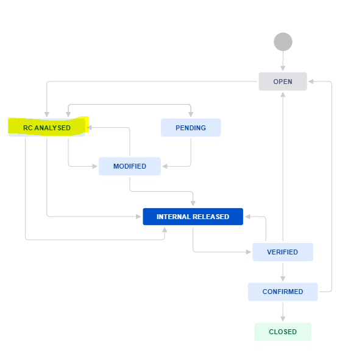
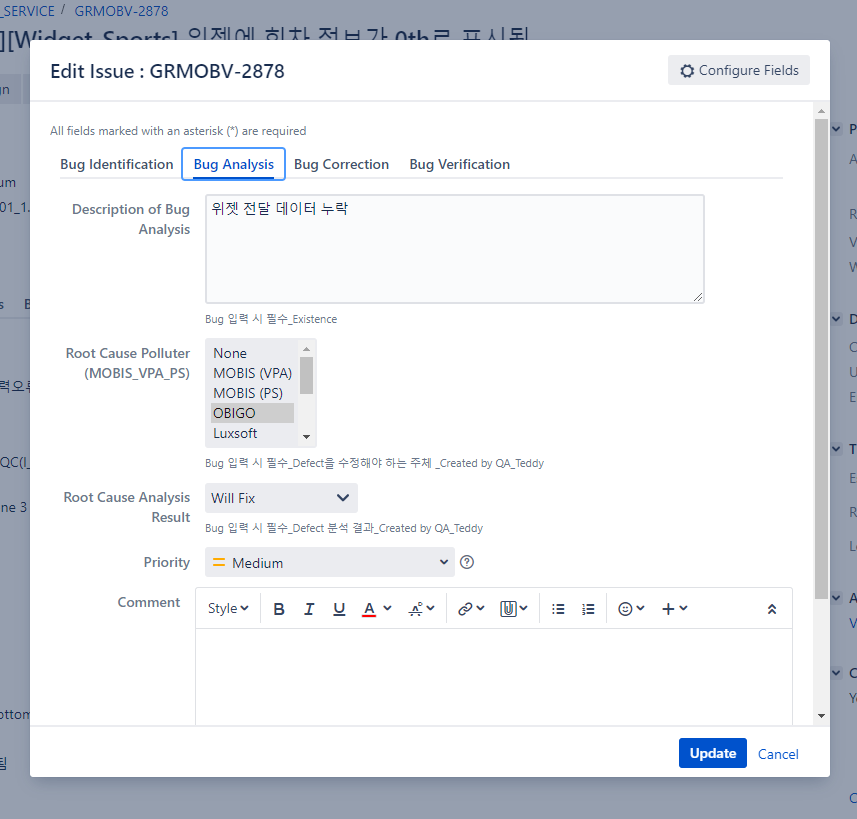
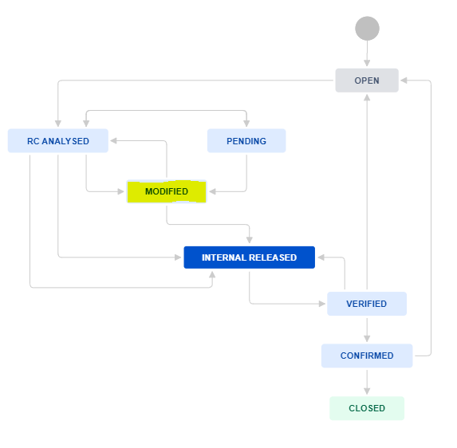
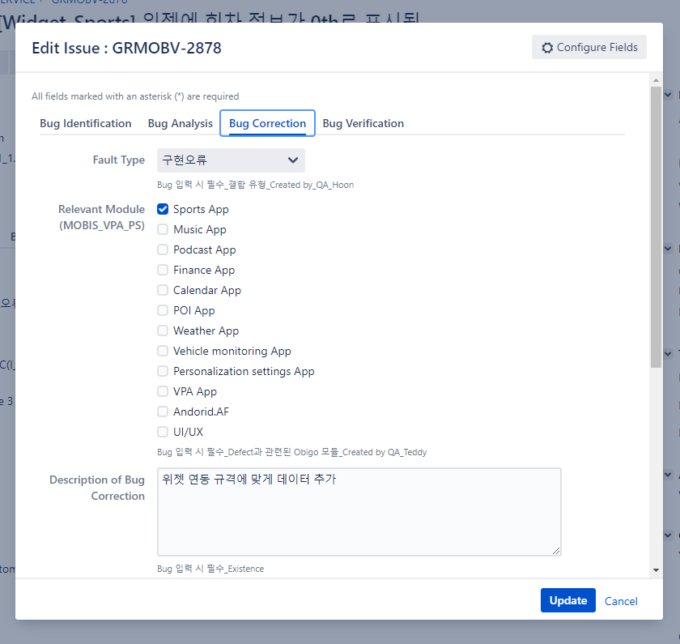
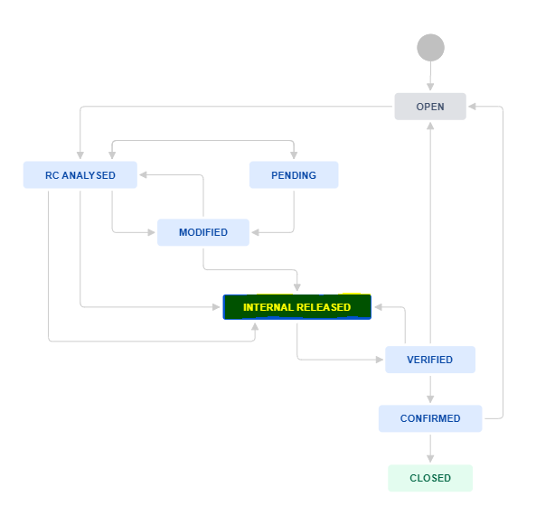

# Obigo

## JIRA Issue

JIRA에서 Issue가 할당될 경우, 아래 절차에 따라 Issue를 처리하자.

### 1. 이슈가 할당되면 버그에 대해 분석 후 상태를 RC ANALYSED로 변경해준다.

	

### 2. 분석 내용을 Bug Analysis에다 기입

​	

#### Description of Bug Analysis

어떤 이유로 버그가 발생했는지 상세히 기재

#### Root Cause Polluter

책임 소재가 어디에 있는지 선택

가령 OBIGO의 개발자의 구현 오류로 이런 Bug가 발생한 것이라면 OBIGO를 선택하는 식

### 3. 버그 수정 후 상태를  MODIFIED로 변경

	

### 4. 관련 내용을 Bug Correction에 작성

	

#### Fault Type

버그에 맞게 유형을 선택, 구현 오류인 경우가 대부분이다.

#### Relevant Module

어느 App에서 일어난 버그인지 선택

#### Description of Bug Correction

해결과 관련된 구체적인 사항은 맨 밑의 Description에 작성

위와 같이 ''기능 구현''이라고만 적어도 무방하지만 최대한 자세하게 적어주는 것이 좋다.

#### End date

버그 수정한 날짜를 작성

### 5. Release 후 Internal Release로 변경

	

### 6. QC팀에게 다시 assign

`Bug Correction`탭에서 `Fix version`을 이번에 릴리즈한 버전으로 수정해주고, QC팀에게 다시 `assign`해주면 된다. 