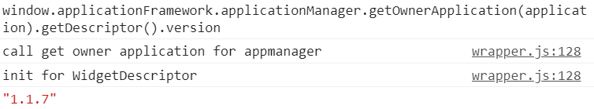

# Obigo

## 🚗MOBIS target

모비스 개인화 서비스 프로젝트의 애플리케이션은 최종적으로 `Android apk`로 제공된다. 따라서 내가 속한 모빌리티 서비스 2팀에서는 `Vue`로 만든 애플리케이션을 `wgt`으로 빌드한 후  Android AF 팀에 요청해 다시 apk로 빌드해야 한다.

Sanity Test 결과를 작성하거나 타깃에서 정상적으로 작동하는지 확인하기 위해 adb 명령어를 사용할 필요가 있다.

> adb가 무엇인지, 어떻게 설치하는지는 아래의 링크를 확인해보자.
>
> https://kibua20.tistory.com/165

### 애플리케이션 설치하기

```bash
$ adb install -r test_app.apk
Performing Push Install
test_app.apk: 1 file pushed. 6.3 MB/s (45780627 bytes in 6.912s)
	pkg: /data/local/tmp/test_app.apk
Success
```

-r 옵션은 재설치의 의미로 기존에 동일한 애플리케이션이 설치되어있다면 삭제 후 재설치 되고, 기존에 동일한게 설치된 애플리케이션이 없어도 문제 없이 설치 된다.

### 애플리케이션 삭제하기

애플리케이션을 삭제하기 위해서는 먼저 해당 애플리케이션의 package 이름을 알아야 한다. 다음 명령어는 디바이스에 설치된 모든 패키지의 이름을 출력한다. 애플리케이션 이름과 패키지 이름이 비슷하다면 여기서 찾아볼 수 있다.

```bash
$ adb shell pm list packages

package:com.google.android.networkstack.tethering
package:com.android.cts.priv.ctsshim
package:com.google.android.youtube
package:com.android.internal.display.cutout.emulation.corner
package:com.google.android.ext.services
package:com.android.internal.display.cutout.emulation.double
package:com.android.providers.telephony
package:com.android.dynsystem
package:com.android.theme.icon.pebble
...
```

그리고 아래 예시처럼 삭제해주면 된다.

```bash
$ adb uninstall com.google.android.youtube
Success
```

### wgt 설치하기

오비고에서는 타깃의 지정한 영역에 wgt 파일을 push 하면 해당 wgt을 설치하도록 구현되어있다. 개발한 후 바로 타깃에서 확인해보고 싶을 때 wgt으로 빌드해서 설치하면 된다. 순서는 다음과 같다.

```bash
$ adb root
```

먼저 adb를 root 권한으로 재실행한다.

```bash
$ adb push places-dev-0.x.x.wgt /mnt/user/10/emulated/10/Android/data/com.mobis.personalization.places/files/widgets/1.wgt
```

여기서 wgt 파일이 있는 경로에서 위 명령어를 실행시켜주면 된다. 애플리케이션마다 경로가 다르므로 경로를 작성할 때 주의하자.

### 크롬에서 확인하기

1. chrome://inspect/#devices 접속

2. Discover network targets 체크 해제

#### 버전 확인하기

아래 명령어를 통해 현재 App의 버전을 확인할 수 있다.

```bash
window.applicationFramework.applicationManager.getOwnerApplication(application).getDescriptor().version
```

	

### 추가로 알아두기

#### 개인화 서비스 서버 연결이 되지 않을 경우

- 아래의 방법으로 다시 설치해보기

```
adb install --user 10 설치할 apk명.apk
adb shell pm install-existing --user 10 com.mobis.personalization.personalizationservice
adb shell sync
```

- 인터넷 연결이 제대로 이루어졌는지 체크하기(limited connection인 경우 날짜를 오늘로 바꾸면 된다.)

#### wgt 업데이트가 되지 않을 경우

- `wgt sideload service` 알람이 떴는지 체크
- 앱의 `config` 버전을 증가시켜 시도해보기
- `force stop` 후 업데이트 진행해보기

#### Luxoft 런처에서 버그 발생할 경우

`2022-08-25`에 Ryan님이 보낸 메일 내용 참조

# :books:참고자료

 https://info-lab.tistory.com/122


