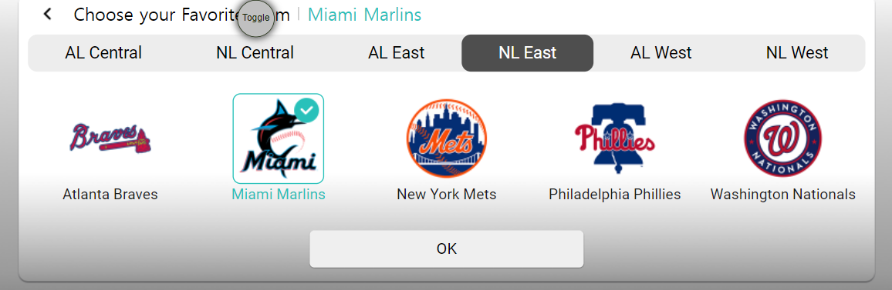
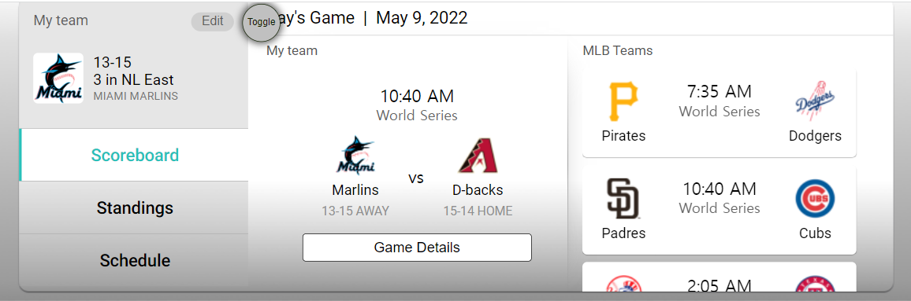

# Obigo

## Sports App

### About Issue



위 애플리케이션은 MLB 리그에 대한 정보를 제공하는 애플리케이션이다. 위 화면에서 자신이 좋아하는 팀을 선택하면 해당 팀에 대한 세부 정보를 얻을 수 있다.



문제는 위 페이지에서 발생했다. 이 페이지에서 Edit 버튼을 누르면 팀 선택 페이지로 다시 이동을 하게 된다. 해당 페이지에서 팀을 선택하지 않고 헤더의 뒤로 가기 버튼을 누를 경우 팀 정보 제공 페이지에서 이루어졌던 작업들이 유지되지 않고 모두 초기화되는 현상이 발생했다.

QC팀에서 해당 이슈를 등록한 이유는 팀을 새롭게 선택하지도 않았는데 팀 선택 페이지가 새롭게 로드되는 것이 부자연스럽다고 생각했기 때문인 것 같다.

## How to solve

가장 먼저 든 생각은 Keep Alive Component를 활용하는 것이었다.

```vue
<keep-alive v-if="isKeepAlive" :exclude="keepAliveExcludes">
  <router-view :key="$route.fullPath"></router-view>
</keep-alive>
<router-view v-else></router-view>
```

먼저 상위 컴포넌트에서 isKeepAlive의 값을 prop으로 전달해 true일 경우 isKeepAlive 컴포넌트가 생성되도록 했다. 그 다음에 Keep Alive Component의 exclude prop에다가 배열로 페이지명을 전달해 특정 페이지들 사이에서만 상태가 유지될 수 있도록 했다.

## :pen:Further Study

사실 멘토분의 도움으로 코드를 수정하는 것 자체는 어렵지 않았다. 다만 router-view 의 key prop에 대한 이해가 부족해 이에 대한 학습을 별도로 진행했다.

### route.fullPath

- 유형 : String
- 쿼리 및 해시를 포함한 전체 확인 URL

위 코드처럼 key prop에 fullPath 를 바인딩하는 이유는 뷰 라우터는 동일한 컴포넌트 내에서의 변화를 감지하지 못하기 때문이다.

가령, 쇼핑몰의 상품 상세 페이지에서 다른 상품 상세 페이지로 이동을 한다고 생각해보자. 일반적으로는 어떤 상품 상세 페이지에서도 동일한 컴포넌트를 반환할 것이다. 하지만 그 안의 데이터가 변동되기 때문에 우리는 다른 페이지를 본다고 인식한다. 뷰 라우터는 그 데이터의 변화를 감지하지 못하기 때문에 바인딩된 fullPath로 강제로 이동해 새롭게 로드를 시키는 것이다.

# :books:참고자료

https://hj-tilblog.tistory.com/99

https://stackoverflow.com/questions/41301099/do-we-have-router-reload-in-vue-router