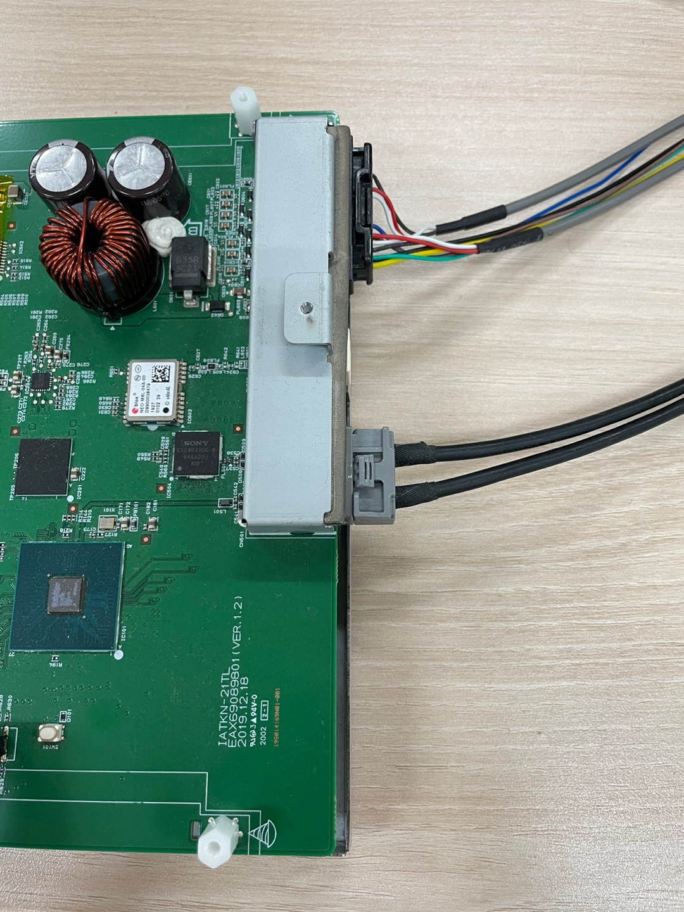
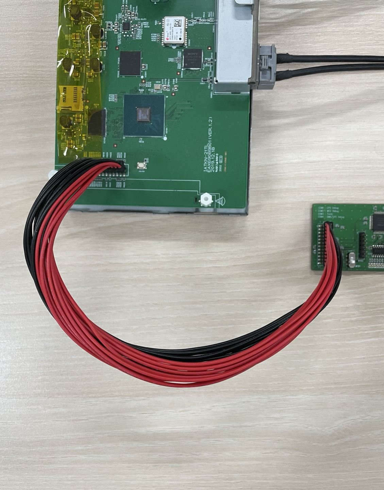
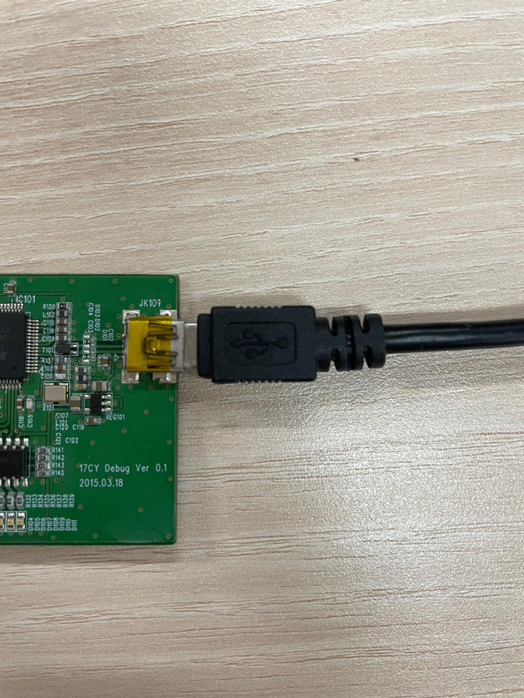
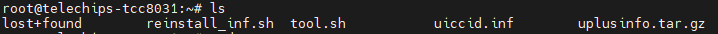
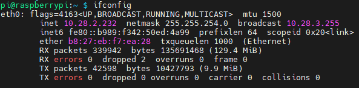
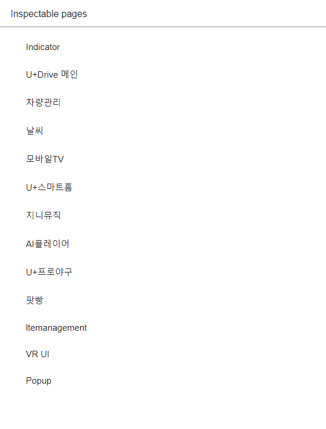

# Obigo

## Toyota 타겟 연결하기

### 하드웨어 연결

1. AMTelecom사에서 제공해준 LCD 모니터와 타겟을 연결
   

2. 이후 MEU와 라즈베리파이를 연결(이 때 빨간색 선이 밖으로 가게끔 연결)

   	

3. 라즈베리파이와 usb를 통해 시리얼 연결
   

4. 랜선 연결

   네트워크를 연결하지 않으면 실행되지 않으니 꼭 체크할 것!

___

컴퓨터와 Toyota 타겟을 연결할 때는 시리얼 연결을 사용한다. 시리얼 연결을 위해서는 가상 단말기 프로그램이 필요하다. 일반적으로 puTTY를 많이 사용하지만, 팀내에서는 현재 MobaX를 사용한다.

#### :bulb:Tip - 가상 단말기 프로그램을 사용하는 이유

일반적으로 가상 단말기 프로그램을 사용하는 이유는 서버는 물리적으로 떨어져 있어도 단말 장비를 통해서 원격으로 접속하여 작업할 필요가 있기 때문이다. 이런 경우에 윈도우같은 개인 pc 운영체제에서도 서버로 접속할 수 있도록 물리적인 단말장비가 아닌 논리적인 가상 단말기를 제공해주는 것이다.

### Mobx 사용하기

#### 타겟 연결하기

1. **왼쪽 상단의 Session 클릭**

2. **Serial 선택**

3. **Serial Port 선택 및 Speed(bps) 설정**

   일반적으로는 연결 포트중 가장 낮은 포트를 선택하면 된다. 하지만 정확한 확인이 어렵기 때문에 터미널에서도 재확인해야 한다. 그리고 Speed(bps)는 115200으로 설정해야 연결이 가능하다.

4. **아래 정보로 로그인 진행**

   id : root / pw : 1922@21cy

타겟 연결 후에 아래 작업들을 각각 실행해주면 된다.

#### 바이너리 설치 방법

타겟 접속시 경로는 /home/root이다. 여기서 ls 명령어를 통해 목록을 확인해보면 아래와 같다.

	

1. **uplusinfo.tar.gz 파일 교체**

   - Code Freeze 메일이 오면 브랜치 정보를 확인하고 obigo-af-apps-updater 저장소의 릴리즈 부분에서 tar.gz 파일을 가져와 교체

   - 해당 작업은 Ally님이 주로 하신다고 하지만, 그래도 그 방법에 대해서는 알아둘 것.

2. **uiccid.inf 파일 동일 경로에 있는지 확인**

   uiccid는 차량 고유 정보를 담고 있는 파일이다. 현재 팀내에서 사용 중인 타겟들이 동일한 uiccid를 사용하고 있어 한 쪽이 사용중일 경우 로그인이 되지 않으니 주의하자.

3. **`./reinstall.sh ./uplusinfo.tar.gz` 명령어를 통해 바이너리를 설치**

   reinstall.sh는 설치 로직을 미리 작성해놓은 스크립트이다. 이 스크립트를 실행하고 그 인자로 바이너리 파일인 uplusinfo.tar.gz 파일을 전달해주면 된다.
   
   이전에 inf 파일을 사용했던 적이 있지만, 지금 사용하지 않으므로 reinstall.sh 스크립트를 사용하면 된다.
   
   이 때 설치 로직에서 uiccid.txt가 있는지 확인하고 해당 uiccid를 실제 uiccid가 사용되는 경로에다 덮어씌운다. 그러니까 업데이트를 하기 전 uiccid 정보를 확인하고 싶다면 아래 경로에서 확인하자.
   
   **`/run/uplusdata/obigo/SA`**

#### 로그 확인 방법

1. **` cd /run/log` 명령어로 로그 파일이 저장된 경로로 이동**
2. **`cat [로그 파일명]` 명령어로 로그 파일을 확인**

#### 디버깅을 위한 인스펙터 페이지 연결

1. **타겟에서 ssh 로 raspberry pi 접속 후 ip 확인**

   id: pi / pw: #amTel0504@1

   raspberry pi 내부 ip: 192.168.128.129

​		

2. **inet 주소 뒤에 :9223을 붙여 인스펙터로 접속**

   			

### Toyota 앱 수정 후 확인 방법

1. **obigo studio에서 수정할 앱의 폴더를 열기**

2. **인증서는 OB.Obigo-TY.ToyotaLv2 사용, store 앱만 Lv1 사용**

3. **obigo studio에서 실행 탭 선택**

4. **타겟 단말 추가**

5. **inet 주소를 호스트 이름에 추가**

6. **사용자 이름과 비밀번호는 아래 정보 사용**

   id : root / pw : 1922@21cy

7. **추가된 단말을 선택하고 확인 클릭**

   빌드된 폴더가 없으면 자동으로 빌드가 된 후 타겟으로 전송된다.

## 스마트홈 관련 정보

- 스마트홈 계정은 컨플루언스에서 확인

- 프로필 설정
  - ./tool.sh profile1

- 업무용 폰으로 렉서스 커넥트 앱 실행(Ally님 자리)
- 타겟에서 스마트홈 접속시의 비밀번호 : 1111

# :books:참고자료

https://dololak.tistory.com/24

