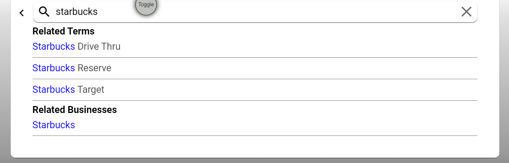

# Obigo

## Places App



주변 사업체 정보를 알려주는 `Places App`에서 자동완성 기능을 구현한 과정을 기록으로 남긴다.

## How

자동완성 기능의 전체적인 실행 흐름은 다음과 같다.

1. 검색어를 입력한다.
2. 외부 `api`를 통해 입력한 검색어와 관련된 키워드들을 가져온다.
3. 해당 키워드들을 위 이미지와 같은 형태로 만들어 렌더링한다.

전체적인 흐름만 봤을 때는 간단해보이지만 개인적으로는 키워드들에서 검색한 단어를 강조 표시하는 게 조금 어려웠던 것 같다. 코드를 살펴보자.

```js
  watch: {
    async searchKeyword() {
      const response = await this.$api.getAutoComplete(this.searchKeyword)
      if (response.status) {
        const { data } = response
        const re = new RegExp(this.searchKeyword, 'i')
        const dataHighlighted = data.map((item) => {
          const highLighted = item.text.replace(
            re,
            '<span class="highLighted">$&</span>',
          )
          delete item.text
          item.textHighLighted = highLighted
          return item
        })
        this.autocomplete = dataHighLighted
      }
    },
  },
```

좀 더 쉬운 이해를 위해 코드를 생략하거나 간단화시킨 부분들이 있는 점을 미리 밝힌다.

1. 먼저 플러그인을 통해 미리 만들어둔 `getAutoComplete` 메서드에 입력한 검색어를 넣어 실행한다.

2. 현재 입력한 검색어를 찾는 정규표현식을 만든다.

3. 가져온 키워드들을`map` 메서드로 순회하며 입력한 검색어와 일치하는 부분을 위의 `html`로 바꿔준다.

   `replace`메서드에서 `$&`기호의 의미는 아래 링크를 참조하자.

   > [매개변수가 `string`으로 지정되었을 때](https://developer.mozilla.org/ko/docs/Web/JavaScript/Reference/Global_Objects/String/replace#%EB%A7%A4%EA%B0%9C%EB%B3%80%EC%88%98%EA%B0%80_string%EC%9C%BC%EB%A1%9C_%EC%A7%80%EC%A0%95%EB%90%98%EC%97%88%EC%9D%84_%EB%95%8C)

4. `data` 속성중 `autocomplete` 에 강조 표시가 된 키워드들을 할당한다.

## :pen:Explanation

#### 정규표현식 작성

키워드에서 검색한 단어와 일치되는 부분이 있다면 대소문자에 관계없이 강조 표시가 이루어져야 한다. 아래 설명을 살펴보자.

> *플래그를 활용한 고급 탐색*
>
> 정규 표현식은 전역 탐색이나 대소문자 무시와 같은 특성을 지정하는 플래그를 가질 수 있습니다. 플래그는 단독으로 사용할 수도 있고, 순서에 상관 없이 한꺼번에 여럿을 지정할 수도 있습니다.
>
> 생성자를 사용할 경우 이렇게 지정합니다.
>
> ```
> const re = new RegExp('pattern', 'flags');
> ```

```js
const re = new RegExp(this.searchKeyword, 'i') // 플래그 i : 대소문자를 구분하지 않음.
```

#### 키워드 강조표시하기

> 가져온 키워드들을`map` 메서드로 순회하며 입력한 검색어와 일치하는 부분을 위의 `html`로 바꿔준다.

위의 과정을 수행하면 각 키워드들은 다음과 같은 형태로 바뀐다.

##### -> `<span class="highLighted">키워드와 검색어가 일치하는 부분</span>` + 일치하는 부분을 제외한 검색어

이를 정상적으로 렌더링하기 위해서는 강조표시된 키워드를 `v-html` 디렉티브로 전달해야 한다.

```html
<div
     v-for="(item, index) in autocomplete"
     :key="index"
     >
    <div v-html="item.textHighLighted"></div>
</div>
```

`v-html`은 요소의 `innerHTML`을 업데이트하기 때문에 실제로는 다음과 같이 렌더링된다.

```html
// 검색어가 Starbucks이고, 키워드가 Starbucks Drive Thru인 경우
<div
     v-for="(item, index) in autocomplete"
     :key="index"
     >
    <div>
        <span class="highLighted">Starbucks</span>
         " Drive Thru "
    </div>
</div>
```

#### Scoped CSS 이슈 해결하기

하지만 `v-html`을 사용할 경우 `Scoped CSS` 때문에 `CSS`가 제대로 적용되지 않는 현상이 발생한다.  `VueJs`의 `Scoped CSS`기능은 `VueJs`의 내장 기능이 아니라 `vue-loader`에서 제공하는 기능으로 해당 기능은 특정 컴포넌트의 스타일이 해당 컴포넌트에만 적용되도록 강제하는 역할을 한다.

```html
<div data-v-b0fae8c0 data-v-15bb7a41>
	<span class="highLighted">Starbucks</span>
	" Drive Thru ""
</div>
```

`Scoped CSS`를 사용하면 위와 같이 `DOM` 속성에 랜덤한 속성 이름이 생성이 되고 스타일 시트의 클래스 이름은 그 속성 이름과 함께 명시되기 때문에 해당 `DOM`에만 영향을 주도록 범위가 제한(scoped)된다. 하지만 보다시피 `v-html`로 추가한 span의 경우에는 속성 이름이 생성되지 않은 걸 확인할 수 있다.

이를 해결하기 위해서는 `Deep Selectors`을 사용하면 된다.

```css
&::v-deep .highLighted {
    color: blue;
}
```

`Deep Selectors`에 대해 좀 더 자세히 알고 싶다면 아래 링크를 참고하자.

> https://vue-loader.vuejs.org/guide/scoped-css.html#deep-selectors

# :books:참고자료

https://lukashermann.dev/writing/how-to-use-async-await-with-vuejs-components/

https://developer.mozilla.org/ko/docs/Web/JavaScript/Guide/Regular_Expressions

https://blog.jeongwoo.in/vue-js-scoped-css-1b77c9a1b8bb