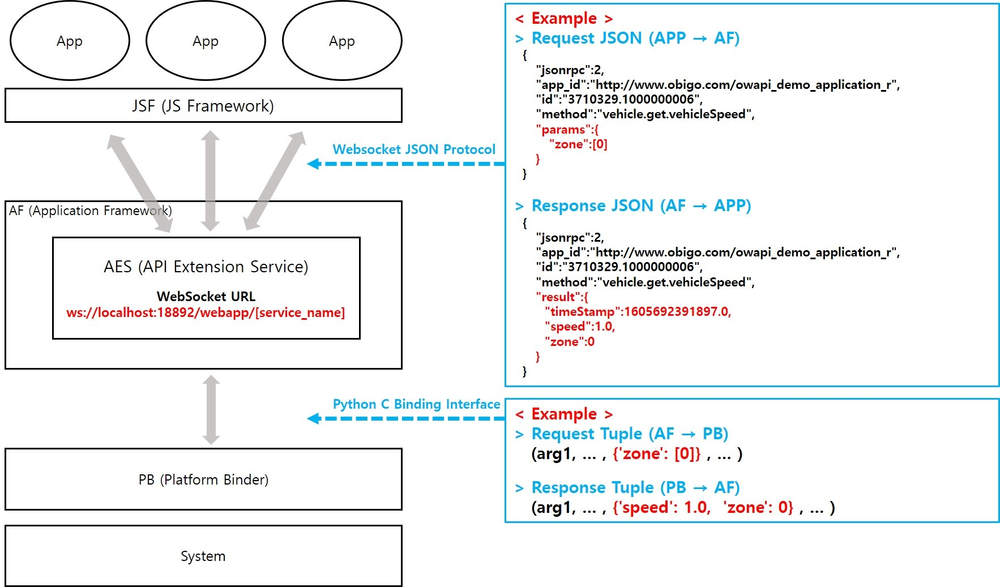

# Obigo

## WebAPI 배포하기




오비고에서는 Device(System) API인 WebAPI를 사용한다. 쉽게 정리하자면, 위 구조에서 App과 System사이의 연동을 위해 통로 역할을 해주는 것이다. 배포 과정은 아래와 같다.

## 배포 과정

1. WebAPI 수정 후 빌드
2. 빌드된 API를 저장
3. 배포 진행
4. 컨플루언스 페이지에 배포 페이지 작성
5. Web API docs 업데이트 후 배포 페이지에 첨부
6. 관련 담당자분들께 릴리즈 공지 메일 보내기

> WebAPI는 수정과 배포를 위한 총 2가지 저장소가 존재한다. 수정 저장소에서는 실제 코드를 변경하고, 배포 저장소에서는 단순히 수정 저장소에서 빌드한 API를 기존의 API와 교체하면 된다.
>
> - **수정 저장소**
>
> Repository : https://github.com/OBIGOGIT/obigo-sdk-ojsf-webapi-u
>
> Branch : master
>
> - **배포 저장소**
>
> Repository : https://github.com/OBIGOGIT/obigo-sdk-ojsf-webapi
>
> Branch : 각 project 별 상이

### 1. WebAPI 수정 후 빌드

수정 저장소를 clone해 실제 코드를 수정한다. 

#### 새로운 도메인 생성

1. Z폴더 안의 rt 폴더에 도메인명으로 폴더를 생성

   이 때 Z는 단순히 인덱스상 가장 마지막에 위치시키기 위한 이름으로, 특별한 의미가 있지는 않다.

2. 도메인 파일 생성

   같은 프로젝트의 도메인 파일을 복사해 붙여넣기

3. 도메인명을 모두 교체

4. apiObject 안에 event name을 교체

5. version 메서드의 version 변경

   신규 도메인의 경우 1.0.0.0으로 변경

6. 신규 도메인이 정의된 js 파일을 config-owapi.js 파일에서 빌드된 dist 폴더에 매핑

   ```js
   "dist/obigo-sdk-ojsf-webapi/widget/widget": "./obigo_module/webAPIs/Z/lib/rt/widget/widget_api_ssdg_bm.js"
   ```

7. scripts로 빌드 실행

   모든 Lgu+ 과제(쌍용, 도요타 등)는 모두 `build4ssdg-bm`  scripts를 사용하면 된다.

8. dist/obigo-sdk-ojsf-webapi 폴더에 빌드된 모든 파일들을 복사

**:bulb:Tip**

> 실제로 번들링이 진행되지는 않고, 난독화 작업까지만 진행된다.
>
> 그리고 WebAPI는 다른 NodeJS 라이브러리에 의존적이지 않기 때문에 실행시킬 때 node 버전은 크게 상관없다.

### 2. 빌드된 API를 저장

배포 저장소를 clone해 API를 교체한다. 위에서도 말했지만, 배포 저장소는 프로젝트마다 다른 브랜치를 사용한다. 현재 모든 Lgu+ 과제(쌍용, 도요타 등)는 `digen_01` 브랜치를 사용한다.

1. package.json, README 파일을 제외하고 모든 폴더와 파일들을 교체
2. package.json에서 마이너 버전 업 진행

**:bulb:Tip**

> 수정 저장소는 master 브랜치에, 배포 저장소는 해당 프로젝트 브랜치에 push를 진행하면 된다.
>
> 이 때, 수정 저장소는 딱히 커밋 컨벤션이 없지만, 배포 저장소 같은 경우 아래의 컨벤션을 따른다.
>
> <span style="color: red;">[수정 저장소의 커밋 넘버] [이번 WebAPI 배포 버전]</span>
>
> ex) "df4b55a 1.0.58"

### 3. 배포 진행

배포 저장소에서 배포를 진행한다. 기존 배포 기록들을 확인해 내용만 바꿔주면 된다.

### 4. 컨플루언스에 배포 페이지 작성

1. 기존 릴리즈 페이지 복제

2. 제목, 본문의 버전 변경

3. version information의 previous와 current 변경

4. 그 아래 내용은 수정한 내용을 반영해 작성

   가령 새로운 도메인을 추가했을 경우 아래와 같이 작성한다.

   > - New API
   >
   >   Add domain (domian name)

### 5. WebAPI 문서 업데이트 후 배포 페이지에 첨부

WebAPI 문서는 웹프레임웍 정합 기술서를 참고해서 작성한다.

### 6. 관련 담당자분들께 릴리즈 공지 메일 보내기

아래 사항 필수 포함

- 추가된 WebAPI 도메인
- 도메인의 이벤트
- 이벤트의 메서드
- 릴리즈된 tar.gz 파일
- docs

| 프로젝트명 | 담당자            | 비고 |
| ---------- | ----------------- | ---- |
| U100       | Ryan님, Cloud(BM) |      |
|            |                   |      |
|            |                   |      |

